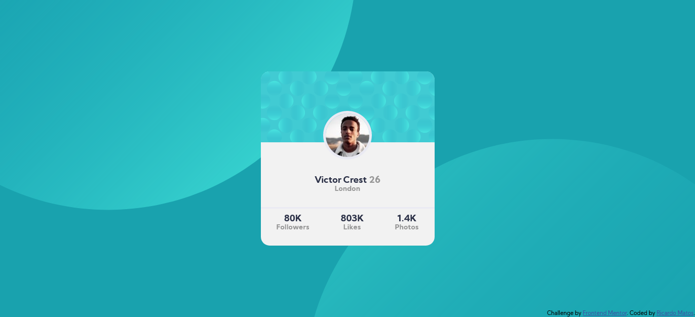

# Frontend Mentor - Profile card component solution

This is a solution to the [Profile card component challenge on Frontend Mentor](https://www.frontendmentor.io/challenges/profile-card-component-cfArpWshJ). Frontend Mentor challenges help you improve your coding skills by building realistic projects. 

## Table of contents

- [Overview](#overview)
  - [The challenge](#the-challenge)
  - [Screenshot](#screenshot)
- [My process](#my-process)
  - [Built with](#built-with)
  - [What I learned](#what-i-learned)
  - [Continued development](#continued-development)
  - [Useful resources](#useful-resources)
- [Author](#author)

**Note: Delete this note and update the table of contents based on what sections you keep.**

## Overview

### The challenge

- Build out the project to the designs provided

### Screenshot

## My process
  I started with HTML using divs to put the content where I wanted so that I could use Flexbox properly. I started by positioning the card in the center of the body, and to divide it in top and bottom. After that I used Flexbox to align the bottom content in the center using flexbox-direction: column. After that, I used flexbox again two times, the first to position the name and location vertically, and the second to position the stats horizontaly. Then, I edited the fonts using the style guide properties given and positioned the circle with the photo inside. The last thing that I did was the two background circles and their position. I tried to make them responsive using media queries but I think that was the part that I had more difficulties.

### Built with

- Semantic HTML5 markup
- CSS custom properties
- Flexbox

### What I learned

In this project I used for the first time SVG so at first I didn´t know how to apply them but then I asked some developer friends that helped me.
I had some difficulties to proper position the background circles but I think I've done a solid job.

### Continued development

I want to develop the use of media queries to make my projects more responsive.

## Author

- Website - [Jorge Ricardo Amorim Matos](https://www.your-site.com)
- LinkedIn - 

